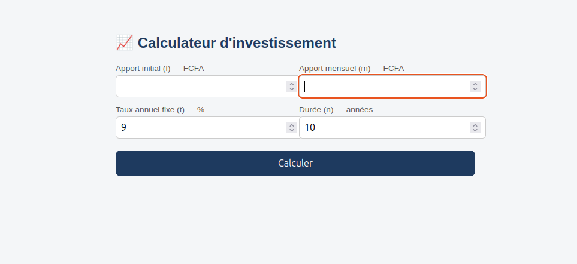
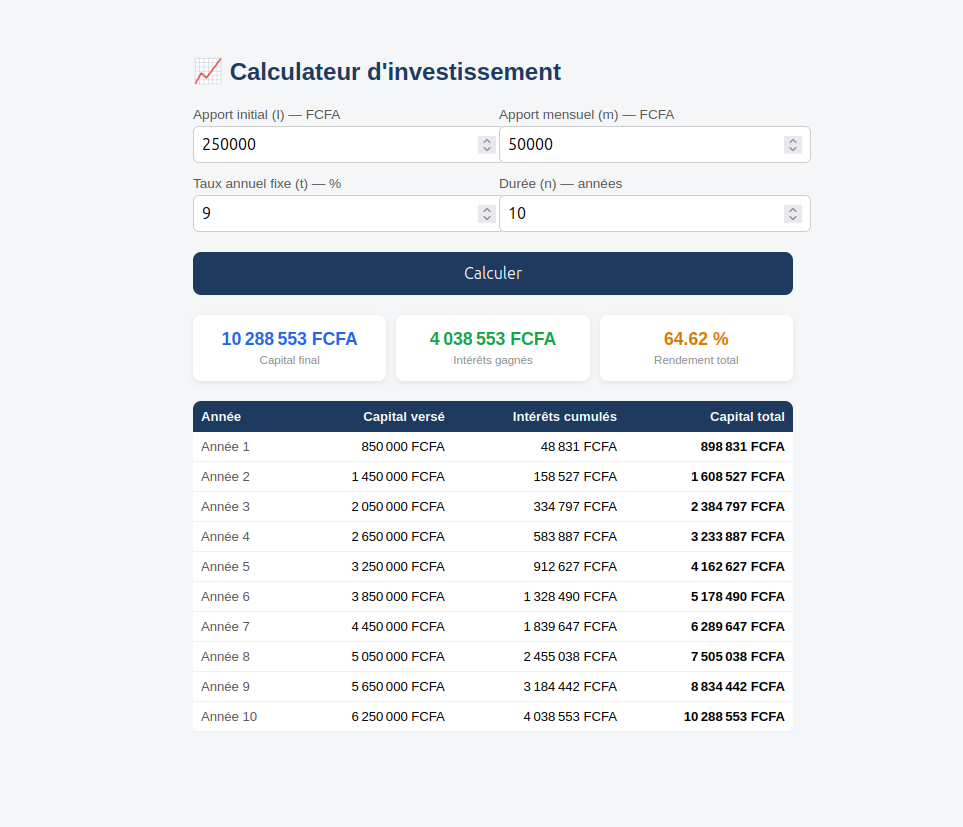

# Calculateur d'investissement

Un petit outil web pour estimer le rendement d'un investissement sur plusieurs années, avec un apport initial, des versements mensuels et un taux d'intérêt annuel fixe.

## Captures d'écran

**Formulaire de saisie**



**Résultats avec tableau d'évolution annuelle**



## Aperçu

Le calculateur applique la formule des intérêts composés avec versements réguliers :

```
C = I × (1 + r)^N + m × [(1 + r)^N - 1] / r
```

où :
- `I` : apport initial
- `m` : apport mensuel
- `r` : taux mensuel (taux annuel / 12)
- `N` : nombre total de mois (années × 12)

## Utilisation

Ouvrez simplement `index.html` dans un navigateur, ou via un serveur local :

```bash
# Avec Python
python3 -m http.server 8000

# Avec Node.js (npx)
npx serve
```

Puis rendez-vous sur `http://localhost:8000`.

## Structure du projet

```
calculateur-investissement/
├── index.html          # Structure de la page
├── style.css           # Mise en forme
├── script.js           # Logique de calcul
├── screenshots/        # Captures d'écran
└── README.md
```

## Technologies

- HTML5
- CSS3
- JavaScript vanilla (aucune dépendance)


## 🌐 Demo en ligne
👉 [lopere008.github.io/calculateur-investissement](https://lopere008.github.io/calculateur-investissement/)

